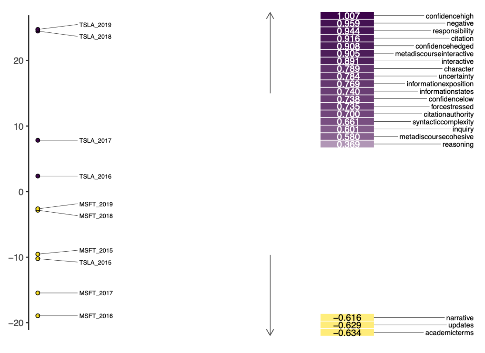

# Sentimental Analysis and Topical Modeling of Big-tech Tweets

Short excerpt from the paper is provided below:

## Abstract
> In this paper we address questions related to sentimental and topical trends, as well as linguistic variations found within tweets. We examine Twitter data related to 5 Big-Tech companies, and later restrict our attention to tweets for Tesla and Microsoft, both of which reasonably represent two opposite ends of the sentimental polarity. Statistical methodologies such as topic modeling and factor analysis are utilized to address the research questions, and are accompanied by corpus linguistic techniques like part-of-speech tagging to prepare the data for analysis. We find that topical tendencies generally provide good context for understanding distinct sentimental trends in tweets. Positive and negative tweets also tend to have clear differences in linguistic characteristics, but the findings may need to be taken with a grain of salt. In the future, it would be worthwhile to put in more effort to filter out non-human generated noise as they tend to contaminate and skew the data.

## 1. Code Structure
    .
    ├── code                                # Code files (.R)
    │   ├── ds_dict.yml                     # Docuscope dictionary used for part-of-speech (POS) tagging and calculation of sentiment scores
    │   ├── multidimensional_analysis.R     # Multi-dimensional Analysis of tweets with differing sentimental polarity
    │   ├── sentiment_time_series.R         # Sentiment score calculation and time-series plot for 5 Big-tech companies (2014 Dec ~ 2019 Dec)
    │   ├── topic_modeling.R                # Latent Dirichlet Allocation (LDA) topic modeling to analyze topical tendencies of tweets
    ├── doc                                 # Documentation files
    └── README.md

## 2. Data
The dataset was part of a paper published in the 2020 IEEE International Conference under the Intelligent Data Mining track (Mustafa Do ̆gan, Et al. 2020), primarily to determine possible speculators and influencers in the stock market. The dataset contains over 3 million unique tweets with features such as tweet id, post date, text body, and the number of comments and likes matched with the related company ticker.

Part-of-speech tagging was done using the [Docuscope](https://github.com/docuscope/DocuScope-Dictionary-June-26-2012) dictionary.

## 3. Keyness Tables (Log-likelihood)

## 4. Sentimental Time Series Graph

After using [Docuscope](https://github.com/docuscope/DocuScope-Dictionary-June-26-2012) for part-of-speech tagging, the sentiment scores were calculated by subtracting the normalized count of negative categories from the normalized count of positive categories.

Below are the sentiment scores of tweets over time with 95% Confidence Intervals (CI). 

## 5. Multi-dimensional Analysis (MDA)

MDA was used to analyze linguistic characteristics between two corpora with differing sentimental polarity (TSLA vs MSFT).

